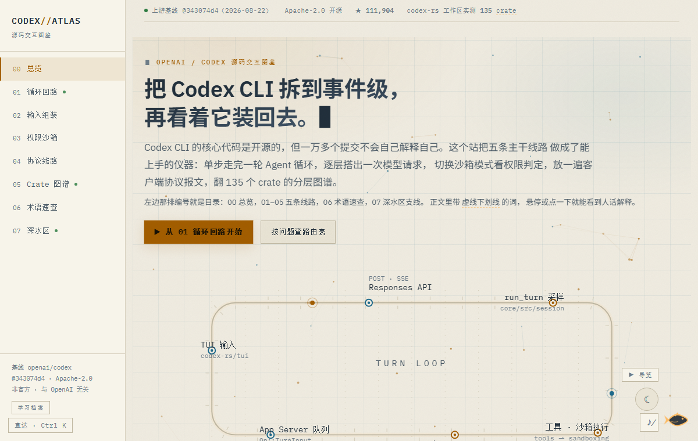
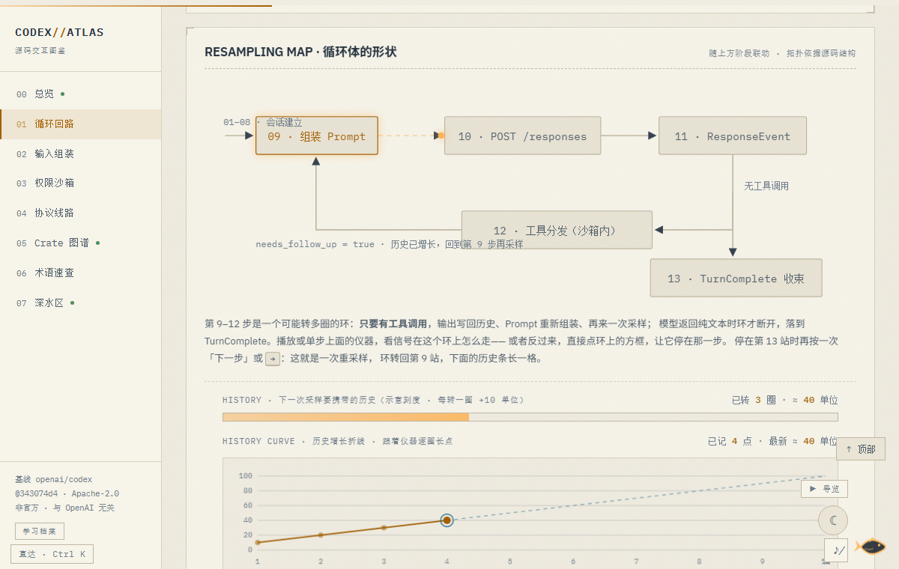
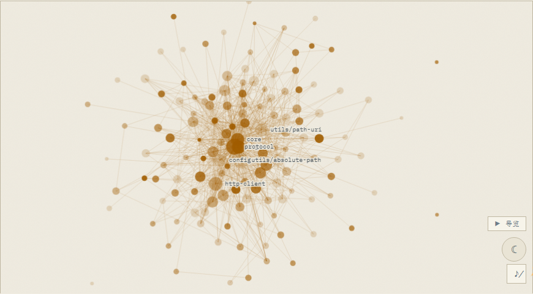
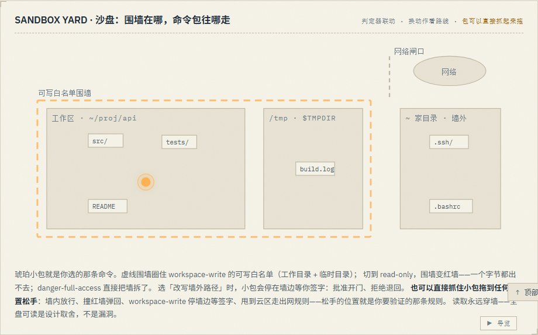

# CODEX ATLAS · openai/codex 源码交互图鉴

把开源的 Codex CLI 拆到事件级的中文交互学习站。编号 00 是总览，01–05 是五条主干线路，07 是支线深水区，06 是术语速查：

| 线路 | 页面 | 回答什么 |
|---|---|---|
| 01 循环回路 | `labs/loop.html` | 一轮对话从 `codex` 命令到 TurnComplete 的 13 个阶段，单步可停；配会话建立段、重采样回路图（随阶段联动，支持拖拽平移 / 滚轮缩放 / 双击复位）、TURN SIMULATOR 沙盒（自己开一轮：发输入、调工具、运行中 steer 并入）与「先猜后揭」的成本对照（缓存折扣率可拖：左右拖那个数字，看缓存优势被蚕食）；**CI 视角**——`codex exec --json` 的 stdout JSONL 三剧本回放（纯文本 / 工具调用 / turn.failed），事件模式按 exec_events.rs 实测，右侧演示流水线用 jq 怎么消费 |
| 02 输入组装 | `labs/prompt.html` | 一次 Responses API 请求的七层构成；负载构成条、实时负载形状预览（与层开关双向悬停互亮、一键复制）、AGENTS.md 层叠与 32 KiB 上限演示、立方视图（3D 层叠：拖拽环视、滚轮 / 双指缩放、闲置轻摇）；COMPACT 演示——拖滑杆看历史爬升、触顶自动压缩成 encrypted_content 摘要，每轮增量也是可拖数字；触发规则实测：默认阈值 = 上下文窗口 × 90%（config 只能调早不能调晚），双条件触发（缓冲阈值或全窗口用满），pre-turn 触发现场有切片；**抽层实验**——把七层塔当积木抽：每抽一块塔身倾斜、稳定度按该层真实分量掉落，抽塌了读塌法（每层附「抽掉会怎样」的人话后果） |
| 03 权限沙箱 | `labs/sandbox.html` | 三种模式 × 审批策略 × 六动作的判定器、联动全景矩阵与判定管线（信号包逐段穿闸）、SANDBOX YARD 空间沙盘（**命令包可以直接抓起来拖**：墙内放行 / 撞红墙弹回 / 停墙边等你签字 / 甩到云区走出网规则）、FREE CONSOLE 任意命令归类判定、可点击的审批弹窗 mock、MCP DETOUR 双路径对比（内置穿墙 vs MCP 绕墙）、config.toml / CLI 片段生成器（一键复制）、**权限流沙仪**（细胞自动机：命令沙穿过读/写/拒绝三层膜，穿过的沉底变绿、被拦的堆红，三档位切膜开口）；三套 OS 机制对照；策略变换管线切片（policy_transforms.rs 的 glob 仅限 deny-read / 合并与交集之别 / 平台沙箱判定纯函数，manager.rs 的平台分派与 Forbid-Require-Auto 三态） |
| 04 协议线路 | `labs/appserver.html` | App Server 双生命线时序图 + 报文时间线；审批请求怎样挂起整轮对话并分出批准 / 拒绝两条剧情。第二幕：resume / fork / interrupt 三条支线时间线。**THREAD SANDBOX**——Thread 生命周期状态机交到你手里：十种动作随便按，非法迁移当场拒绝并给理由，wire/notify 方法名实测，下方 WIRE REGISTRY 里九个可演方法有「沙盒▶」直达按钮；第三幕（ACT III）：rollout 文件解剖——JSONL 逐行点看、实测文件名规则生成器（回滚线程追加第二 ID）、crate 模块图、**冷档压缩工**切片（compression.rs：七天冷期后 zstd 压成 .jsonl.zst，锁 6 小时防重叠，与模型上下文压缩无关）；报文 JSON 带语法着色；报文可深链——`?msg=方法名` 直达并展开该条（分支专属报文自动带上裁决），点任意已送达报文即得分享链接 |
| 05 Crate 图谱 | `labs/atlas.html` | 固定提交下 codex-rs 的 136 个成员逐条注解，九条功能带 + 构成比例带 + 带间动线 + 检索高亮；「面积树图」视图（squarified 布局）与「3D 星系」视图（手写零依赖 3D 投影：拖拽旋转带惯性、缩放锚定光标、闲置自转、带聚焦、自动导览，固定种子可复现；**线框球**开关——GitHub Globe 手法，经纬细线框当舞台，实测依赖边升级为带高度的圆弧航线，光点沿弧飞行）；「力学视图」——136 点力导向依赖图（手写物理：Hooke 弹簧 + 两两互斥 + 向心收拢 + 速度衰减，拖任意一点全网重新找平衡，悬停看出入依赖，带芯片聚焦，摇一摇重排）；**实测依赖探查器**——829 条依赖边爬自 136 份 Cargo.toml，详情卡显示每个 crate 的实测出/入依赖（可点击跳转）+ 依赖排行 + **邻居迷你图**（选中 crate 居中、右出左入环绕成小宇宙，悬停高亮、点邻居直接跳过去）；**DEPENDENCY PATH 两点之间**——任选两个 crate 在实测有向边上跑 BFS：最短依赖链渲染成可点芯片（点任意一环检索定位、四视图同步聚焦），查不通当场明说并检查反方向，「随机一对」当抽卡玩，每次查询附**影响面（blast radius）**——反向 BFS 数出改动会波及的 crate（直接依赖 + 传递分开计数），前 10 个可点直达；**GUESS WHO 猜 crate**——Wordle 规则 × 实测边表：六次机会猜一个藏起来的成员，每猜一次回四条线索（所在带、被依赖/依赖数比谜底大还是小、与谜底间有没有一条实测依赖边），谜底按日期取种子，赢局记本机；「仓库全景」覆盖面树 |
| 06 术语速查 | `glossary.html` | 全站术语的一句话人话解释，可检索；正文里的虚线下划线词悬停即出卡片。三种练法：「自测」翻卡主动回忆（记得 / 忘了写入本机存档，忘了的卡自动沉到队尾重练）；「配对」canvas 拖线连线游戏（按住术语拖到人话短句上，连对锁线、连错弹回——弹回时成绩行给出「去现场」直达链接，一步跳到讲它的仪器，如 TurnComplete 直达 04 时间线那条报文，失误纪录存本机） |
| 07 深水区 | `labs/deep.html` | 主干之外的七间房，各一台小仪器：A 凭据流选择器 + 续期时序仪 + **凭据环流仪**（令牌生命周期 canvas，ChatGPT 路线每三圈走一次 401 → refresh 小环）；B config 组装台 + **优先级汇流图**（四路来路谁最后落进汇合点谁说了算）+ 四层优先级阶梯；C apply_patch 补丁解剖台（可编辑可应用可弄坏；**逐行讲解器**——点补丁任一行弹出自述气泡，顺序＝解析器校验顺序，能弄坏的两行附「亲手弄坏它」直达；**标注笔**——Excalidraw 手感自由圈画，双描手绘抖动、Ctrl+Z 撤销）；D TUI 拟态终端 + 斜杠命令面板（选中命令回放进终端：本地响应不出站；流式渲染链真实切片已闭环：收集器 → FIFO 队列 → 表格扣留 → commit tick 节拍器 → 宽度契约）；E 扩展机制挂点地图 + **HOOKS 事件轴**（8 个事件名实测自 hooks crate 的 events/ 目录，按会话生命周期排列）；F **Code Mode 实验位**——普通模式 vs V8 跑模型代码的双模式对比播放器（明确标注为本站推演），附 crate 家族实测名单；G **源码覆盖地图**——全站切片台账：47 个文件坐标（46 份逐行切片 + 1 个文件级）、16 个 crate 的坐标全部摊开，行悬停展开完整源码路径、可过滤、可直达展出仪器，「还没拆的」如实列出 |
| 08 调用栈下潜 | `labs/dive.html` | 滚动即下潜的纵向叙事页（The Deep Sea 手法）：从 L0 你敲下的命令一路沉到海沟底 POST /responses，深度计 / 光照衰减 / 浮尘反向漂移全部由同一个滚动插值主值驱动；十一站坐标全部来自已核对切片；**深度转盘**——左侧深度轨可拖 / 可点 / 可键盘（方向键逐站、悬停显示站名），十一站不用滚，直接到 |

## 长什么样

| | |
|---|---|
|  总览 · 粒子场与线路卡 |  01 · 单步仪与重采样回路 |
|  05 · 力导向依赖图（136 点物理模拟） |  03 · 空间沙盘（包可抓取拖拽） |

## 全站交互

- 首页动效层（`assets/fx.js`，零依赖手写）：hero 信号粒子场（constellation 连线，指针可拨开）、眉题文字解码、基线数字滚动、线路卡片 3D 倾斜 + 指针聚光灯（外层平面跟踪防 hover 抖动）、主按钮磁吸。全部在 `prefers-reduced-motion` / 触屏下自动关闭。
- **流体光标尾迹**（`assets/fluid.js`，仅首页）：零依赖 CPU 版 Stable Fluids（Jos Stam GDC 2003）——半拉格朗日平流 + Jacobi 压力投影，132 格低分辨率网格解算染料后双线性放大；指针划过拖出琥珀墨迹、点按砸一团，能量耗尽自动停表。触屏 / reduced-motion / 「静」不启用。
- **星云滚动回力**：滚动速度除注入 film grain 外还加速星云流速（停手即回落），hero 对滚动有实时手感。
- 阅读进度条（顶部琥珀线）：支持 CSS scroll-driven animations 的浏览器走原生滚动时间线（零 JS 监听），其余走 rAF；区块滚动浮现；跨页 View Transitions（支持的浏览器自动启用）。
- 按 `?` 呼出快捷键速查；`Esc` 关闭弹层或清空搜索。
- 全站命令面板：`Ctrl K` 或 `/` 呼出，跨页直达任意线路与仪器（含 01 第 10 站、CONFIG BRIDGE、SANDBOX YARD、MCP DETOUR、术语自测、07 七间房、rollout 解剖等深链），方向键 + Enter 全键盘操作。
- 每页末尾 CHECKPOINT 成绩存本机 localStorage，首页线路卡上显示「自检 n/n」通关徽章；五条全部集齐时首页点亮「五条全通」，站宠游屏庆祝一次。
- 站宠「小鳕」（右下角）：待机时轻轻浮沉，悬停冒一句短话，点一下游过屏幕并给一条真实使用提示；页面闲置半分钟会自己巡游一圈；连点七下有彩蛋；**任意页面（非输入框）连打 `codex` 五个键，鱼群出动**。按住可以拎起来甩出去——抛体物理（重力 + 撞墙反弹 + 地面摩擦），飞行中能半空接住，落定后自己游回角落；轻点行为不受影响。与 Codex 词源无关，纯属谐音梗。
- 各仪器的状态持续写入地址栏 hash，刷新或分享链接不丢进度。
- 标题遮罩揭示：各页 h1/h2 进入视口时从遮罩里升起（SplitText 整块版，reduced-motion 保持静态）。
- 首页大标题带弹性动力：字符被光标斥开、弹簧回位（kinetic-typography ELASTIC 的手写版）。
- 指针设备上，总览线路卡、03 模式卡与 06 翻卡带聚光倾斜微交互（光标跟随的琥珀微光 + 轻微 3D 倾斜）；首页有全局光标聚光、hero 粒子场（鼠标斥力 + 点击爆裂）与主面板呼吸微光；触屏与 reduced-motion 自动关闭。
- 自检 ALL CLEAR / 五条全通时彩纸庆祝一次（canvas，重力 + 旋转，2.4 秒自清理）。
- 星系视图支持「带聚焦」：点带名镜头缓动转过去、只亮那条带，再点一次解除。滚轮缩放锚定光标（OrbitControls 的 zoomToCursor），右键拖拽平移，双击复位。
- **全站线路图**（首页）：9 站地铁图（08 调用栈下潜为第二上行支线），站点外圈是各页自检/翻卡的实时进度环，光点沿主线与两条支线往返；站点可点击直达、键盘可达；五条全通后枢纽站点亮徽章。08 已同步进侧栏导航与移动端菜单。
- **全站速通挑战**（首页）：从 19 题题库（`assets/quiz-bank.js`，与各页 CHECKPOINT 同源）随机抽 8 题，每题 20 秒倒计时，数字键可作答；最佳成绩存本机，破纪录触发彩纸与站宠庆祝。
- **微音效引擎**（`assets/sound.js`）：零音频文件、WebAudio 现场合成 11 种音色（盖章 / 答对 / 答错 / 通关 / 水泡…）；右下角 ♪ 开关默认关闭，偏好持久化，页面隐藏不发声。
- **全局动效开关「静」**（右下角，`ca-motion` 持久化）：一键关掉全站环境动画——所有仪器走与系统「减少动态效果」相同的静态通道初始化，再按一次恢复。演示、截图、省电场景用。
- **拨弦休息区**（首页底部，`assets/strings.js`）：五根弦对应五条主线，光标划过即拨响——线段相交判定、划得越快振幅越大，阻尼正弦振动自动归位；弦音走五声音阶（Trionn 琴弦手法），键盘 Tab + 回车可拨，触屏拖划有效。
- **404 也是一页**：失联示波器可以按住画一笔——你画的信号和自动脉冲一样指数塌回直线；移动端补齐了菜单导航，入口列表含 08。
- **学习档案**：左栏底部或 Ctrl K 呼出——自检成绩、翻卡进度、足迹统计一目了然，可导出 JSON、两步确认重置（音效偏好保留）。
- 代码片段一键复制：03 的 config.toml、02 的负载 JSON、07B 的 TOML 片段都挂 ⧉ 复制按钮。
- Stripe 式双向悬停互亮（02）：悬停组装栈的层，负载预览里对应 JSON 段高亮；反过来悬停预览段，层亮边。

## 核对基线

站点的每个数字都对得上固定提交——这件事不用信口说，有脚本：

```bash
python tools/verify_baseline.py              # 全量：成员名单 + 819 条依赖边 + wire 方法名
python tools/verify_baseline.py --skip-deps  # 快速：只对名单和方法名
```

脚本从站点文件里提取钉住的基线号和全部数据，实时抓取该提交下的上游文件逐项比对；顺带看上游 main 漂到哪了。退出码：`0` 全对上 · `1` 数字对不上（附差异清单）· `2` 上游已漂移该换基线。`.github/workflows/baseline.yml` 每周一自动跑一次，漂移时自动开 issue。

## 运行

纯静态站点：零依赖、无构建步骤、无外部脚本（仅 Google Fonts 一条可失败的链接）。

```sh
# 任意静态服务器均可
npx http-server . -p 8080
# 或
python -m http.server 8080
```

## 基线与证据边界

- 上游基线固定为 openai/codex main 提交 `cbfd999db78cb088d2bd89b52051efe6f44555a4`（2026-08-22）。
- 站内关键技术声明共 30+ 条经该提交源码逐条核实（文件路径、事件名、config 键名、端点、协议类型、hooks 事件清单、rollout 文件名规则等）；个别上游已漂移的旧社区口径（如 `DiskWriteTempOnly`、`Op::UserInput`）已修正为基线真实符号。
- crate 数量（136）、依赖边（829）、星标数等数字为该日经 GitHub API / Cargo.toml 实测；上游持续变化，以固定提交为准。
- 内容来源分三类并在页内就地标注：① 仓库文件（可复核）；② OpenAI 官方博客《Unrolling the Codex agent loop》《Unlocking the Codex harness》；③ 社区源码研究，仅作交叉参考。
- 凡属推断或示意（报文形状、体积刻度），页面内均明确标注。本站不运行模型，不发起网络请求。

本站为非官方学习项目，与 OpenAI 无隶属关系。发现事实错误请提 issue，注明具体页面与依据。

## 部署

推送到 `main` 后由 GitHub Actions 自动部署到 Pages（`.github/workflows/deploy.yml`）。

## 许可证

MIT。上游 openai/codex 为 Apache-2.0；本站未复制其源码，只引用公开文档事实与其仓库内可复核的路径名。
